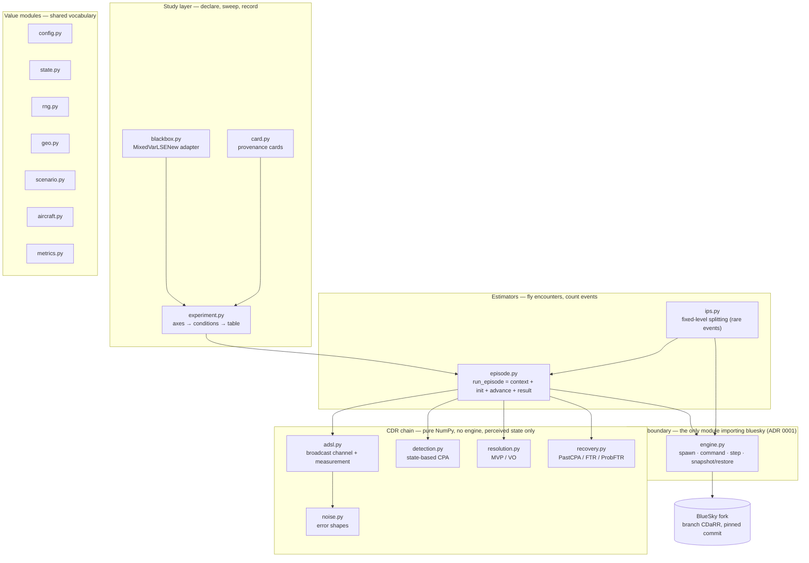
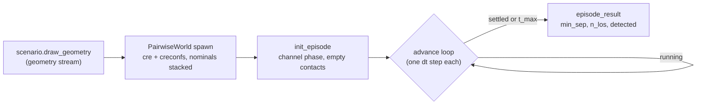

# Architecture

The package is a stack of four layers over one external engine. Dependencies point
strictly downward; the value modules on the right are used by everyone and depend on
nothing above NumPy.



## Why the seam is the design

[`engine.py`](../blueskycdarr/engine.py) is the only file that knows BlueSky exists.
Everything third-party — process-global initialisation, `cre`/`creconfs` spawning, the
fork's per-aircraft turn-limiter arrays, stepping, and the world snapshot — lives behind
it. Two consequences:

- **The CDR chain is pure.** Detection, resolution, recovery, the channel, the noise
  shapes: all functions of explicit arrays. They are tested in milliseconds without a
  simulator, and they cannot accidentally read truth, because truth lives on the other
  side of the seam.
- **Unit traps are contained.** BlueSky speaks calibrated airspeed in knots and miss
  distances in nautical miles; this package is SI ground-frame throughout. Every
  conversion happens once, at the boundary — including the ground-speed→CAS conversion
  whose absence made CDaRR's drones creep ~0.5 % faster per re-command
  (`notebooks/bluesky_speed_command.ipynb` demonstrates the trap).

The engine itself is a **process-global singleton** (`bs.traf`): one world per process.
The Monte-Carlo path deals with that by spawning a fresh batch per episode and fanning
episodes over worker processes (each worker owns an engine). The rare-event path deals
with it by making the world **copyable**: `WorldSnapshot` is a generic walk of BlueSky's
`TrafficArrays` registry — complete *by construction*, because BlueSky's own
create/delete machinery forces every per-aircraft variable through that registry — plus
the simulation clock, its timers, and the conflict bookkeeping. Restore-then-step
continues **bit-identically** ([`tests/test_snapshot_parity.py`](../tests/test_snapshot_parity.py)).

## The invariants, and where each is enforced

| Invariant | Enforced by | Pinned by |
|---|---|---|
| Only `engine.py` imports `bluesky` | ADR 0001; code review | the import graph itself |
| CDR acts on perceived state, never truth | `episode.advance` hands the chain only views | `test_cdr_chain`, `test_episode` (blind aircraft collide) |
| Commanded ground speed is the ground speed flown | ground→CAS conversion at the boundary | `test_episode::test_commanded_ground_speed...` |
| `config + seed -> result`, bit for bit | `rng.py` stateless `child()` addressing; frozen configs | `test_rng`, `test_episode` (seeded reproduction), `test_ips` |
| Same encounters in every sweep condition (CRN) | episode seeds hang off the root by index alone | `test_experiment` |
| Counts, not intervals | `MonteCarloEstimate` carries `n_los`/`n_encounters`; IPS reports ratios to anchors | ADR 0004; `metrics.py` |
| Closed, fail-fast schemas | `__post_init__` validation on every config; closed axis vocabulary | `test_config`, `test_experiment` |
| World snapshots only at post-step boundaries | `_require_empty_stack` guard in `engine.py` | `test_snapshot_parity` (guard test) |
| A particle carries *all* future-affecting state | `EpisodeState` + `WorldSnapshot`; streams stay outside | `test_snapshot_parity` (clone/resume, divergence) |

## One episode, end to end



What happens inside one `advance` call is the subject of
[episode-anatomy.md](episode-anatomy.md); what the estimators build on top of it is
[rare-events.md](rare-events.md) for IPS, and the `experiment.py` docstring for the
Monte-Carlo sweep table.

## Map of the repository

```
blueskycdarr/          the package (layers above)
tests/                 the locked specification; engine-backed modules skip w/o the fork
configs/               YAML run files (closed schema; see configs/README.md)
scripts/               the JRESS exp1–exp3 studies + shared plumbing (dummy by default)
notebooks/             executed walkthroughs (experiment axes, the CAS trap, CNS work)
vault/correctness.md   validation evidence, with figures
vault/decisions/       ADRs 0001–0008 — the "why" record
results/               committed experiment outputs + the MC-vs-IPS validation runs
docs/                  this guide
```

The engine dependency is pinned in [`pyproject.toml`](../pyproject.toml) to a commit of
`github.com/fazlurnu/bluesky` branch `CDaRR` — the branch with the per-aircraft
turn-rate limiter this package's dynamics rely on. `ensure_engine()` fails fast on a
stock BlueSky rather than flying silently different dynamics.
