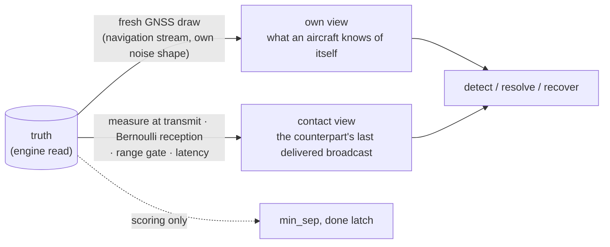

# Anatomy of an episode

[`episode.py`](../blueskycdarr/episode.py) is where every other module composes into a
flown encounter. This document walks one integration step, then explains the
decomposition that lets an estimator pause, clone and resume the loop mid-flight.

## Three clocks, deliberately decoupled

| Clock | Period | Drives |
|---|---|---|
| Integration | `dt` (default 0.2 s) | BlueSky dynamics; truth observation; the running minimum separation |
| CDR | `cdr_dt` (default 1.0 s) | Detection → recovery → resolution on *perceived* state; commands hold between ticks |
| Broadcast | per aircraft: `interval ± jitter`, random phase | Transmissions; each is a noisy snapshot of transmit-time truth, delivered `latency_s` later |

This is CDaRR's cadence structure: the aircraft fly continuously, decisions happen at
the CDR rate, and the radio has its own schedule — which is exactly what lets jitter,
latency and a surveillance range coexist without approximation (ADR 0002).

## Three views of one fleet

The same `StateArrays` container carries three different truths, and keeping them
straight is the package's central discipline:



- **Truth** is read from the engine each step, used only for the running minimum
  separation, the all-clear latch, and the recorder hook.
- **Own view**: at each CDR tick, a *fresh* noisy measurement of the ownship (no
  communication effects — CDaRR's ownship rule; the latency bias shape never applies
  to it).
- **Contact view**: whatever the counterpart last managed to deliver — stale by
  latency plus holdover, or *invalid* if never heard, which is how the surveillance
  range manifests: an unheard aircraft simply does not exist to its counterpart.

## One `advance()` call

```mermaid
sequenceDiagram
    participant A as advance()
    participant W as PairwiseWorld
    participant CH as BroadcastChannel
    participant CDR as CDR chain

    A->>W: truth(), pair_distances()
    Note over A: min_sep := min(min_sep, distances)  — monotone, the level function
    A->>CH: transmit_due(t) — measure, Bernoulli, range gate
    A->>CH: deliver_due(t) — land messages whose latency elapsed
    alt CDR tick due (t ≥ next_cdr)
        A->>CDR: own view + contact view → conflicts
        A->>CDR: recovery on the commands currently FLOWN (last tick's)
        A->>CDR: resolution for aircraft still resolving
        A->>W: command(cmd_trk, cmd_gs) — stacks HDG/SPD, held until next tick
        Note over A: done latch on truth; next_cdr advances
    end
    alt settled ≥ done_timeout, or t ≥ t_max
        Note over A: state.ended = True — engine NOT stepped past the end
        A-->>A: return False
    else
        A->>W: step() — stack drained, dynamics advance one dt
        A-->>A: return True
    end
```

Two orderings in that tick are load-bearing, both inherited from CDaRR and locked by
tests:

- **Recovery decides before resolution, on the *previous* tick's commands.** A fresh
  avoidance command is therefore always flown for one CDR period before the release
  criteria may judge it. Deciding on the same tick's fresh command lets FTR release
  courses that were never flown — measured against CDaRR itself: P(LoS) 0.99 instead
  of 0.03 (ADR 0006).
- **Termination never steps past the end.** On settle or the `t_max` cap the world
  stays at its last post-step boundary and `state.ended` latches. An ending that lands
  exactly on a command-stacking tick leaves dead commands pending — the one boundary
  that cannot be snapshotted, which is why the rare-event estimator discards a dead
  world's leftovers the moment an ending is known (ADR 0008).

## The decomposition: context, state, streams

`run_episode` is composed from four pieces, and the split is not aesthetic — it is the
particle model of rare-event splitting expressed as function signatures:

| Piece | Contains | Lifetime |
|---|---|---|
| `EpisodeContext` (frozen) | config, models, derived tables (speed envelopes, permutations, worldview sigmas) | one per experiment cell, shared read-only by every particle |
| `EpisodeState` (copyable) | channel schedule + in-flight messages, contacts, commands, resolving flags, FTR hypotheses, `min_sep`, clocks, `ended` | one per particle; **everything that influences the future lives here and nothing else** |
| `EpisodeStreams` | four `numpy` Generators (navigation, measurement, reception, schedule) | swappable: the plain episode keeps one bundle; splitting hands each clone a fresh one |
| `PairwiseWorld` | the engine handle (spawn, command, step, snapshot, restore) | one per world session; particle state beyond it rides in `WorldSnapshot` |

The no-hidden-state rule (OpenCDaRR's, adopted wholesale): a future-affecting value
kept in a local, a global, or a closure would be silently *shared between clones*, and
at rare-event probabilities that corruption is invisible in the estimate. The one
deliberate exception — the engine's command de-duplication cache — is reconstructed on
restore rather than carried, because it provably equals the commanded arrays at every
post-step boundary (`engine.PairwiseWorld.restore` documents the argument;
`test_snapshot_parity` pins it bit-for-bit).

`run_episode` itself is then just:

```python
geometry = scenario.draw_geometry(child(episode_seq, 0))     # stream 0: geometry
streams  = EpisodeStreams.from_episode_seq(episode_seq)      # streams 1–4
ctx      = episode_context(scenario.n_pairs, aircraft, config, ...)
with PairwiseWorld(...) as world:                            # spawn, nominals stacked
    state = init_episode(world, ctx, streams)                # phase draw, empty contacts
    while advance(world, ctx, state, streams, recorder):
        pass
return episode_result(state, ctx)                            # min_sep, n_los, detected
```

and is **bit-identical** to the monolithic loop it replaced — verified against a golden
run of the pre-decomposition code with every noise source active. MC and IPS fly the
same loop by construction; there is no second implementation to drift.

## Termination and scoring

The episode ends when every pair has been past its closest approach *on truth* with no
conflict ahead for `done_timeout` seconds (`settled=True`), or at the `t_max` cap
(`settled=False` — the run never settled, which `MonteCarloEstimate` counts). Scoring
is a pure read: `min_sep` per pair, `n_los` as the count below `rpz`, `detected` as
"either side ever perceived the conflict".
