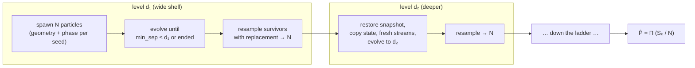
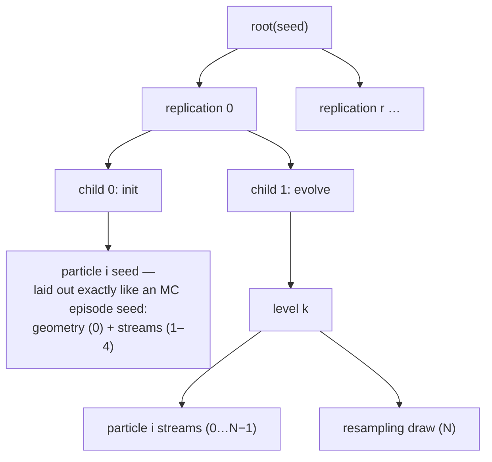

# Rare events: fixed-level splitting on BlueSky

Plain Monte Carlo starves in the rare regime — at P(LoS) ~ 1e-6, a 10⁴-encounter run
reads zero events, and cost grows as 1/p. [`ips.py`](../blueskycdarr/ips.py) is the
fixed-level interacting particle system (Blom et al. 2007), ported from OpenCDaRR
(their ADR 0017) onto this package's engine. ADR 0008 records the design; this
document explains how to *think about and use* it.

## The method in one picture

Nest the rare event in shrinking shells of the running-minimum separation — monotone,
so crossings are one-way. Keep `N` particles; per level, evolve each until it crosses
the shell (survivor) or its encounter ends (dropped); resample survivors back to `N`;
multiply the survival fractions.

`estimate_rare_prob` runs `reps` independent replications of that ladder and averages
them (particles inside one run interact through resampling, so replications — not
particles — are the unit of spread). A level with zero survivors **collapses** the
replication: it reports `P̂ = 0` with `collapsed_at` set — a signal the ladder is
spaced too aggressively, never dressed up as a measured zero.

## What a particle is

One encounter, frozen at a post-step boundary, in two halves:

- **engine half** — `engine.WorldSnapshot`: the whole global BlueSky world, copied via
  the `TrafficArrays` registry walk plus clock/timers. Restoring it and stepping
  continues bit-identically.
- **episode half** — `episode.EpisodeState`: channel schedule and in-flight messages,
  contacts, commands, resolving flags, the running `min_sep`, the clocks.

Because the engine is a process-global singleton, the cloud **time-multiplexes**
through it: evolving particle *i* restores its snapshot over whatever world is live,
copies its episode state, advances, and freezes a new snapshot at the crossing.
Resampling *shares* frozen particles between clones — safe because evolution always
copies before mutating — and clones then diverge only through their **fresh
per-particle-per-level streams**. That split is the estimator's core contract: the
initial cloud samples geometry (and broadcast phase) exactly as an MC episode would,
splitting acts on the forward CNS noise, so **IPS estimates the same per-encounter
P(LoS) the MC backend does** — which is what makes anchor comparisons meaningful.

Particles are plain data, hence picklable: `n_jobs` fans replications over joblib
workers, each with its own engine, and returns the bit-identical estimate.

Special states, all deliberate (ADR 0008):

- An **ended** encounter keeps no world half (`world=None`): its future is closed, it
  rides later levels as a value, surviving only by overshoot.
- The estimator **discards a dead world's pending commands** the moment an ending is
  known — an encounter ending exactly on a command-stacking CDR tick would otherwise
  poison the next restore (found by the first comparison run; pinned in `test_ips`).
- Scenarios must spawn **one pair per episode** (`pairs=(1,1)` enforced): the MC batch
  grid is throughput, not splitting structure. And there is **no tail leg** — a pair's
  loss count is decided at the boundary, unlike OpenCDaRR's fleets.

## Designing a ladder

The estimator is only as good as its levels. What two days of validation runs taught
(all reproducible from [`results/ips_mc_comparison/`](../results/ips_mc_comparison/)):

**Know your cell's failure structure first.**

- *Graded cells* — resolution active but sloppy (heavy position noise, e.g.
  `pos_ci95 ≳ 30 m`, or reception `≲ 0.35`) — degrade continuously: conditional
  survivals of 0.15–0.6 per shell, ladders work beautifully.
- *Cliff cells* — strong CDR (low noise, good reception) — fail through a *discrete*
  mechanism (effectively never-detected encounters), so the min-sep distribution is
  bimodal and mid shells sit in a probability gap no spacing can bridge at modest `N`
  (measured: survival 0.5, 0.47, then 0/32). There you need large `N`, an importance
  function with time in it, or adaptive levels (OpenCDaRR carries `estimate/ams.py`
  for exactly this; not ported yet).

**A recipe that worked** (the 1e-4 validation): pilot the upper ladder cheaply (small
`N`, one replication — survivals tell you where the pinch shells are), then place deep
shells at **order statistics of a pilot MC's depth distribution**, aiming for ~0.45
conditional survival per shell. Watch the collapse counter: one collapsed replication
in six at `N=256` means the pinch shell wants either a neighbour or a wider cloud.

**The validated example** — cell `pos_ci95=25, vel_ci95=3, reception=0.8,
latency=0.3 s`, spawned dead-centre (`dcpa=0, tlos=20`):

| threshold | MC (100 000 encounters) | IPS (N=256, 6 reps) | ratio |
|---|---|---|---|
| 50 m (= rpz) | 9.23e-3 (923 events) | 1.20e-2 | 1.30 |
| 25 m | 4.07e-3 (407) | 5.61e-3 | 1.38 |
| 15 m | 2.24e-3 (224) | 4.0e-3 | 1.78 |
| **0.6 m** | **8.0e-5 (8)** | **9.43e-5** | **1.18** |

The severity tail is *fat* — half of all breaches plow through — so the 1e-4 event of
this cell is a sub-metre miss. The 18-level ladder (upper shells to 15 m, then
7.6/3.3/1.3/0.6 m from order statistics) reached it in 109 s of wall time against MC's
175 s, using ~1.5 % of MC's encounter budget. One IPS run prices *every* threshold on
its ladder: the prefix product through shell *k* is an unbiased estimate of
P(min_sep ≤ dₖ), which is how one run filled that whole table.

Reading agreement: judge on the **ratio** to an anchor (factor of two, or five at
1e-4 and below where the anchor itself rests on a handful of events) — never
intervals. The intermediate thresholds of one run share their upper-shell factors, so
their errors are correlated; do not over-read a single run's mid-ladder wobble.

## The seed tree

Everything is addressed, never consumed (`rng.child`), so any run is a pure function
of `(config, seed)` and any slice of it can be rebuilt independently:

## Cost shape, honestly

- **Level 1 dominates**: one spawn per particle (~100 ms — reset + `cre` +
  `creconfs`). Deeper levels are restores (~0.2 ms, under one integration step) plus
  short stepping legs; overshooting particles skip the engine entirely.
- MC cost scales as **1/p**; the ladder's scales with **depth × N × reps**. At
  p ≈ 1e-2, batched MC is still the cheaper tool on this engine (~750 encounters/s on
  8 workers). The crossover is where you can no longer afford the events — and below
  ~1e-5, MC simply stops being an option.
