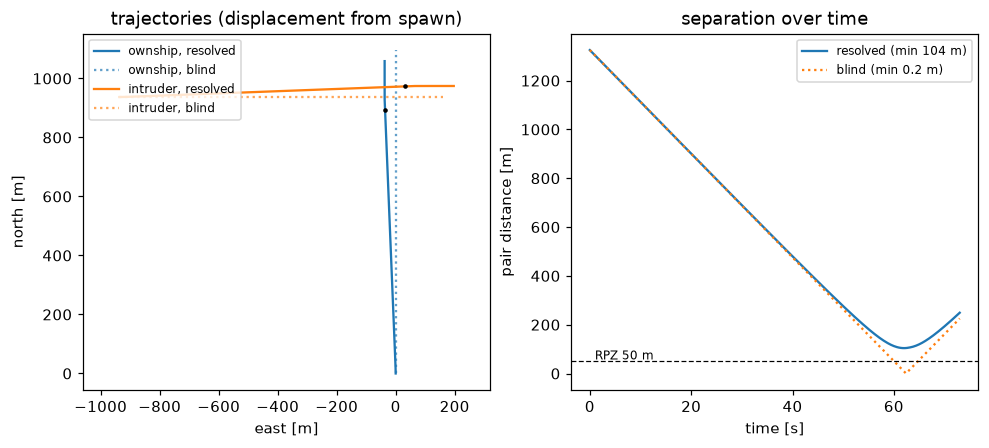
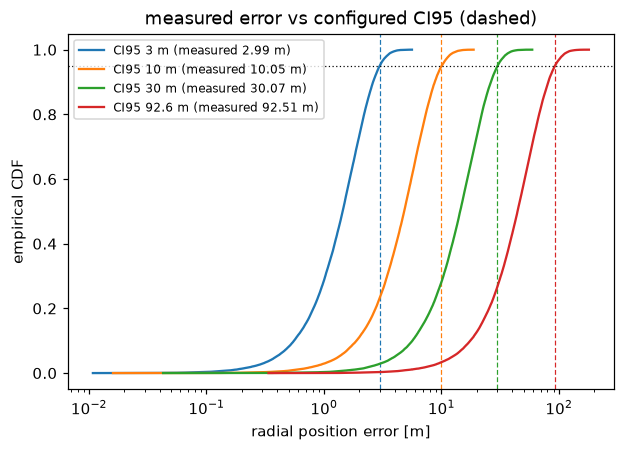
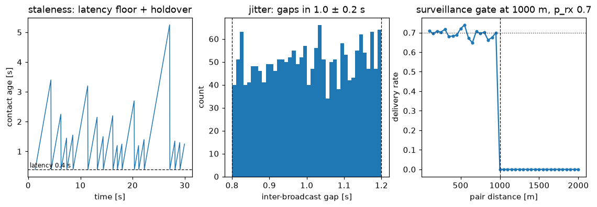
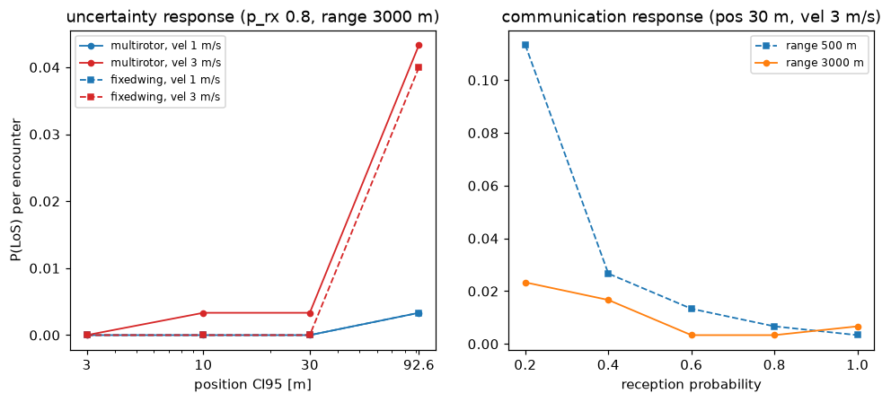
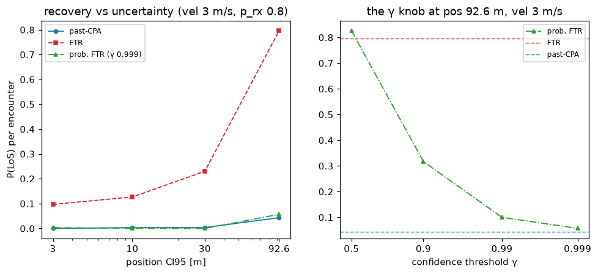

# Correctness: each modelled effect behaves as its definition says, and the P(LoS) response is physical

**Status: validated (v0.0.0, 53-test suite green).** Four figures, each checking one
layer of the pipeline against its own definition rather than against intuition: the CDR
chain on a clean crossing, the measurement noise against its configured CI95, the
broadcast channel (jitter, latency, reception, surveillance range) against its
parameters, and the end-to-end P(LoS) response over the MixedVarLSENew design variables.
Written 2026-08-26. Reproduce with

    .venv/bin/python scripts/correctness_figures.py --jobs 6

(defaults throughout: pairwise encounter, dpsi 90°, dcpa 0 m, cruise 15 m/s, tlos 90 s —
60 s in the single-pair figure — RPZ 50 m, lookahead 120 s, MVP margin 1.05, dt 0.2 s,
CDR at 1 Hz, seed 7; sweep tables land in `results/correctness-*.csv`).

## The CDR chain resolves what a blind aircraft flies into

One pair, 90° crossing, spawned 60 s from loss of separation. Under perfect CNS the
detect → MVP → past-CPA chain bends both tracks and passes at **104 m** (right panel,
solid), comfortably clear of the 50 m protected zone and its 52.5 m resolution zone —
the same order as OpenCDaRR's perfect-information baseline (89 m) on its version of this
crossing. With `reception_prob = 0` the same pair flies ballistically through the
spawned geometry and meets at **0.2 m** (dotted): the conflict generator delivers the
miss distance it promises, and *every* saved encounter below is the CDR chain's doing,
not the scenario's. The engine-backed null test
(`test_blind_aircraft_collide_at_the_spawned_geometry`) pins this permanently.

## Measurement noise delivers exactly the configured accuracy classes

40 000 draws per level through the actual snapshot path (`noisy_snapshot`): the measured
95th percentiles are **2.99, 10.05, 30.07 and 92.51 m** against configured CI95 of 3,
10, 30 and 92.6 m — the `ci95 / 2.448` per-axis sigma is right, at every level the study
sweeps. The same snapshot recomputes `trk`/`gs` from the noised velocity components, so
detector and resolver see one consistent measured velocity (ADR 0002 D1; CDaRR's
detector quietly saw noise-free velocity).

## The channel obeys its four parameters

At `interval 1.0 s, jitter 0.2 s, latency 0.4 s, p_rx 0.7`: the contact age (left) is a
sawtooth whose floor is the **0.4 s latency** — a received state is never younger than
its flight time — and whose tall teeth are holdover across lost transmissions (ages
reach ~5 s, i.e. several consecutive losses at p 0.7, exactly the geometric tail).
Realised inter-broadcast gaps (middle) fill **[0.8, 1.2] s** and nothing outside.
Delivery rate against pair distance (right) sits on the **0.7** reception plateau inside
1000 m and falls to **zero** at the gate — the surveillance range is a hard cutoff
evaluated at transmit time, and an aircraft never heard is never "seen" (ADR 0002 D2).
With jitter 0, latency 0 and the gate off, a locked test shows the channel reduces to
CDaRR's per-tick reception with holdover.

## The end-to-end P(LoS) response is monotone and physically ordered

300 encounters per condition, common random numbers across conditions (ADR 0004);
uncertainty is reported as raw counts only (ADR 0004 update — no interval columns).
Left — with healthy communication (p_rx 0.8, range 3000 m) the chain absorbs position
uncertainty up to 30 m (zero losses in 300 for both airframes at vel 1 m/s), and breaks
at **92.6 m**, harder when velocity uncertainty is 3 m/s:

| aircraft | vel_ci95 | P(LoS) at pos 92.6 m | (n_los / n) |
|---|---|---|---|
| multirotor | 3 m/s | 0.043 | 13/300 |
| fixedwing | 3 m/s | 0.040 | 12/300 |
| multirotor | 1 m/s | 0.0033 | 1/300 |
| fixedwing | 1 m/s | 0.0033 | 1/300 |

The velocity-uncertainty ordering is the physics: velocity noise corrupts the CPA
prediction the resolver steers by, a tenfold P(LoS) step from 1 to 3 m/s; the two
airframes sit inside each other's intervals at this sample size. Median minimum
separation *rises* with noise (106 → 178 m for the quiet multirotor) while the LoS tail
grows — the CDaRR-family signature that noise makes resolution conservative on average
and dangerous in the tail.

Right — at a stressed condition (pos 30 m, vel 3 m/s) the communication axes behave
monotonically: P(LoS) climbs as reception drops, and the 500 m surveillance range
dominates the 3000 m one everywhere (0.113 = 34/300 vs 0.023 = 7/300 at p_rx 0.2), with
detection still at 1.0 — the aircraft *do* eventually see each other inside 500 m, but
late sight leaves tighter misses (median min-sep 93–98 m vs 114–128 m). Loss of separation here is a staleness-and-lateness failure, not a
no-detection failure, which is exactly the regime the level-set study wants to map.

## Why this is the right thing to measure

The package exists to hand MixedVarLSENew a trustworthy `log10 P(LoS)` over five design
variables. Each figure validates one link between a design variable and the number the
oracle returns: the scenario delivers real conflicts (else P(LoS) understates), the
noise levels are the ADS-L classes they claim to be (else the ordinal axes are
mislabeled), the channel parameters do what their names say (else reception/range sweeps
measure implementation artefacts), and the response surface is monotone with sensible
interactions (else the level set is fitting noise). Bit-for-bit reproducibility of a
seeded episode and the CDaRR-reduction of the channel are locked in the test suite
rather than in figures.

## What this still doesn't cover

- **No independent cross-check of absolute P(LoS)** against OpenCDaRR's engine on the
  identical design point — the two-engine comparison is the natural next study and the
  reason this package keeps the BlueSky runtime (ADR 0001).
- 300 encounters resolve the 10⁻² regime; the 10⁻⁵ production threshold needs the
  rare-event machinery that deliberately stayed in OpenCDaRR (ADR 0003).
- The correctness sweeps hold latency (0.1 s) and jitter (0.1 s) fixed; their P(LoS)
  sensitivity is untested here (the channel-level figure covers their mechanics).
- Single geometry (90° crossing). The `dpsi: null` per-pair draw is implemented and
  tested, but no figure sweeps geometry.

## Relations

- [[decisions/0001-bluesky-fork-is-the-engine]] — why these dynamics are BlueSky's.
- [[decisions/0002-event-based-broadcast-channel]] — the channel model under test here.
- [[decisions/0004-metric-seeding-and-crn]] — the estimate, intervals, and seed layout.
- [[decisions/0005-aircraft-catalog-two-airframes]] — the two airframes compared above.

## Update — 2026-08-26: the recovery family, cross-validated against CDaRR itself

The recovery component now carries CDaRR's three models (ADR 0006): past-CPA, FTR and
probabilistic FTR. Two new validations, regenerated by the same script (figures land in
`img/`, tables in `results/correctness-recovery-*.csv`).

**Port fidelity, measured against the original.** On the CDaRR exp1 condition
(dpsi 90°, spawn 180 s before LoS, lookahead 120 s, cruise 10.29 m/s, pos 10 m /
vel 1 m/s, perfect comm), this package against CDaRR's stored `exp1.npz` (10k pairs)
and a direct instrumented rerun of CDaRR's own loop:

| recovery | CDaRR exp1 | here (300 encounters) |
|---|---|---|
| past-CPA | 0.0004 | 0.0000 |
| FTR | 0.0211 | 0.0400 |
| probabilistic FTR (γ 0.999) | 0.0005 | 0.0000 |

Past-CPA and probabilistic FTR agree exactly; FTR sits at 12/300 against CDaRR's 0.0211
— same order, wider than Monte-Carlo noise alone, and expected: since the CAS/ground
frame fix (ADR 0001 update, `notebooks/bluesky_speed_command.ipynb`) this package flies
its configured speeds exactly while CDaRR flies 1.0048x its own and creeps further
during resolutions, and FTR's release chatter is the one model sensitive to that 0.5%.
Its signature is intact either way: median minimum separation at this condition 54.8 m —
released at the zone boundary, margin shaved. (Pre-fix, on bit-identical frames, this
read 8/300, straddling CDaRR's value.)
Getting here surfaced a load-bearing subtlety: CDaRR's FTR criteria judge the command
*applied at the previous tick* (`ap.trk`), so a fresh resolution is always flown for one
CDR period before release; judging the same-tick fresh command instead collapses FTR to
P(LoS) 0.99 on this very condition. The episode loop now runs recovery before resolution
to preserve that ordering, and probabilistic FTR is insensitive to it (its γ 0.999
criterion demands ~3σ beyond the zone, so it never releases at the freshly-commanded
boundary) — the trap that made the family look healthy while one member was broken.

**Behaviour across the design space.**

Left — at vel 3 m/s and healthy comm, past-CPA and probabilistic FTR sit together near
zero until the 92.6 m breakpoint (0.043 / 0.057), while FTR pays for its early release
across the whole axis: 0.097 at 3 m, 0.23 at 30 m, 0.80 at 92.6 m, median min-sep
pinned just above the zone (56–57 m) until it collapses (32.2 m). Position noise
perturbs the perceived clearance FTR releases on, so unlike the other two it degrades
even when the *resolution* still works. Right — the γ knob interpolates between the two
regimes exactly as designed: γ 0.5 reproduces FTR (0.83 vs 0.80), γ 0.999 reaches the
past-CPA regime (0.057 vs 0.043), a factor-15 span in P(LoS) from one confidence
parameter — CDaRR's exp2 story, reproduced end to end on the BlueSky engine.

The matched-condition table doubles as a standing regression: any change to the tick
ordering or the criteria must reproduce it (`fig_recovery_comparison` prints and saves
it). Still not covered: the recovery comparison at reduced reception/range, and the
declared-vs-actual worldview split (CDaRR's exp5).
